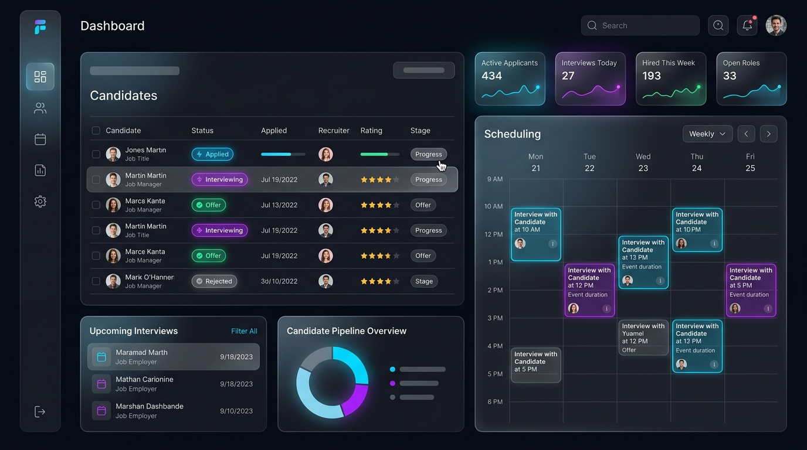

# Pratik Patidar | Frontend Engineer Portfolio

> High-performance, scalable web portfolio built with Next.js, React, and Tailwind CSS.

 <!-- Optional preview image -->

## 🚀 Architecture & Engineering Philosophy
This portfolio is engineered to demonstrate rigorous production standards, focusing on:
- **Performance First:** Route-level code splitting, dynamic imports, and lazy loading for a feather-light initial payload.
- **Predictable State:** Clean component architecture with strict unidirectional data flow and modular design.
- **Defensive Engineering:** Bulletproof TypeScript integrations, custom layout optimizations, and graceful degradation.
- **Modern UI/UX:** Premium glassmorphism, dynamic mesh gradients, and meticulously calibrated typography.

## 💻 Tech Stack
- **Core Framework:** Next.js (App Router) & React 18
- **Styling Engine:** Tailwind CSS + Custom CSS Variables
- **Animations:** Framer Motion (Scroll reveals, layout transitions)
- **Typography:** Inter (Body) & Plus Jakarta Sans (Headings)
- **Infrastructure as Code:** Render Blueprint (`render.yaml`)

## 🛠️ Local Development

Clone the repository and install dependencies:

```bash
git clone https://github.com/PratikPatidar/PortFolio.git
cd PortFolio
npm install
```

Start the local development server:

```bash
npm run dev
```

Open [http://localhost:3000](http://localhost:3000) with your browser to see the result.

## 🚢 Deployment

This project is configured for seamless deployment on **Render** using the included `render.yaml` Blueprint. 

## 📫 Let's Connect
- **Email:** pratikpatidar7990@gmail.com
- **LinkedIn:** [Pratik Patidar](https://linkedin.com/in/pratik-patidar)
- **GitHub:** [pratik-patidar](https://github.com/pratik-patidar)

---
*Designed and engineered by Pratik Patidar. © 2026*
